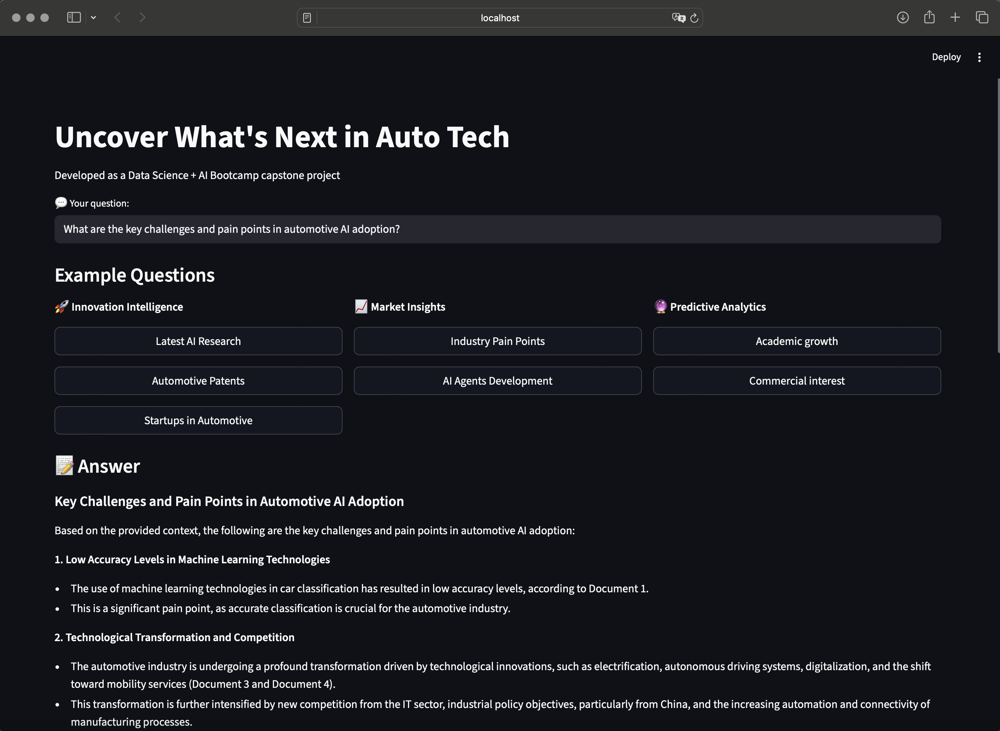
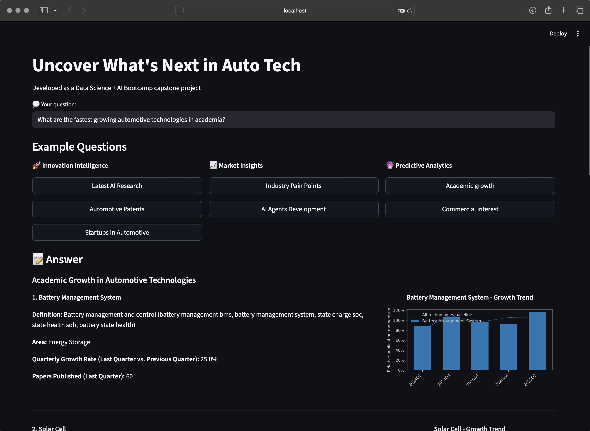

# Innovation Intelligence Suite

## Overview 
This capstone project explores how AI/ML can accelerate insight generation for R&D teams through a modular innovation intelligence suite:

- A **Retrieval-Augmented Generation (RAG)** interface synthesizing information and answering domain-scoped innovation queries
- A **Technology Adoption Readiness Predictor** that classifies emerging technologies by feeding tags into a prediction model
- **Modular design** with intelligent query classification to route requests to appropriate processing modules
- **Automotive AI technology focus** with research papers, tech reports, startups and patent data (2025)


Developed as a Data Science + AI Bootcamp capstone project (2025).

## Features 
- **Intelligent query processing** that classifies and routes requests to appropriate modules
- **Multi-source synthesis**: Query and summarize automotive technology documents (18,000+ chunks)
- **Domain insight retrieval**: Get insights on specific innovation topics from research papers, tech reports, startups and patent data (2025)
- **Transparent attribution**: Source citation with relevance scoring
- **Template-based generation**: Structured answer generation with full transparency
- **Trend analysis**: Topic modeling and trend forecasting based on academic and commercial interest (25,000+ patent and research papers, Fraunhofer ISI-inspired)





## Quick Start

### 1. Clone Repository
```bash 
git clone https://github.com/<yourname>/innovation-intelligence-suite.git
cd innovation-intelligence-suite
```

### 2. Set Up Environment
```bash
python -m venv .venv```

**Mac/Linux:**
source .venv/bin/activate

**Windows:**
.venv\Scripts\activate 
```

### 3. Install Dependencies
```bash
pip install -r requirements.txt
```

### 4. Configure API Keys
```bash
Copy .env.example to .env
Add your Groq API key: GROQ_API_KEY=your_key_here
Get free API key at: https://console.groq.com
```

### 5. Run the System

**Option A: Web interface (Recommended for Demo)**
```bash
cd 05_app
streamlit run streamlit_app.py
Open http://localhost:8501 in your browser
```

**Option B: CLI/Jupyter (For Development & Testing)**

```bash
jupyter notebook
Explore notebooks in 03_notebooks/ to understand the pipeline
Notebook 03_rag_pipeline.ipynb contains the main RAG implementation
```

## Project Structure
```
innovation-intelligence-suite/
├── 01_data/                        # Data directories
│   ├── predictive_model/           # Prediction model datasets
│   └── rag_automotive_tech/        # RAG automotive documents
├── 02_images/                      # Demo & presentation images
│   ├── demo_screenshot1.png
│   ├── demo_screenshot2.png
│   └── hero_image.jpg
├── 03_notebooks/                   # All notebooks organized by module
│   ├── predictive_notebooks/       # Technology adoption prediction
│   │   ├── predictive_components/  # Reusable prediction modules
│   │   ├── 1_dataset_download.ipynb
│   │   ├── 2_auto_area_free_tech_BAAl.ipynb
│   │   ├── 3_predictive_model_baal.ipynb
│   │   └── sourcesEDA.ipynb
│   └── rag_notebooks/              # RAG pipeline development
│       ├── rag_components/         # Reusable RAG modules
│       ├── 01_reports_processing_rag.ipynb
│       ├── 02_retrieval_rag.ipynb
│       ├── 03_generator_rag.ipynb
│       └── 04_interface_rag.ipynb
├── 04_models/                      # Saved models & vector stores
│   ├── predictive_techname/        # Prediction model files
│   └── vector_index/               # RAG vector embeddings
├── 05_app/                         # Streamlit web application
│   └── streamlit_app.py            # Main application file
├── 06_doc/                         # Documentation
│   ├── architecture_diagram.png
│   ├── evaluation_rubrics.md
│   ├── final_capstone_project_presentation.pptx.pdf
│   └── user_queries.md
├── 07_tests/                       # Testing & demos
│   └── demo_outputs/               # Test results & outputs
│       ├── demo_results/
│       ├── generation_tests/
│       └── retrieval_tests/
├── .env                            # Environment variables
├── .env.example                    # Environment template
├── .gitignore                      # Git ignore rules
├── LICENSE                         # Project license
├── README.md                       # This file
└── requirements.txt                # Python dependencies
```

## Demo Queries
Try these in the CLI or web app:
- "Tell me about automotive startups in AI" 🚀
- "What are the challenges in autonomous driving?" 📄  
- "How is AI transforming the automotive industry?" 🔍

## Stack 
- **RAG Pipeline**: LangChain - FAISS - TF-IDF Vectorization
- **Answer Generation**: Template-based with source attribution
- **Interface**: Streamlit & Jupyter notebooks
- **Language**: Python

## What's NOT to push
- Raw PDFs if under copyright (only metadata or short excerpts)
- API keys (use environment variables only)  
- Large model/vector files (>100 MB)
- Processed chunks (can be regenerated)

## Optional/Additional Enhancements
- **MIT License** file added
- Include a **demo video link** or **GIF** in the README
- Add a **Streamlit Cloud or HuggingFace Space** link for live demo
- **TRL Classifier** - Technology Readiness Level prediction (future enhancement)

---
## Development
For development and customization:
- Use 02_retrieval_rag.ipynb for retrieval system improvements
- Use 03_generator_rag.ipynb for answer generation enhancements  
- All notebooks use modular components from rag_components/